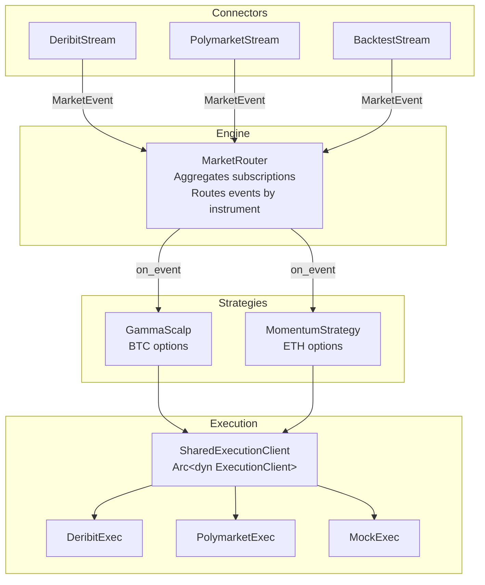

# Rust Async Trading Engine 🦀 📈

A high-performance, event-driven trading framework built in Rust. This engine is designed to run **multiple strategies concurrently** while sharing a single WebSocket connection per exchange, seamlessly switching between **Live Trading** and **Backtesting**.

It solves the "Borrow Checker" challenges common in Rust trading systems by strictly segregating the **Read Path** (Market Data) from the **Write Path** (Execution).

## Building & Running

```bash
# Build
cargo build

# Backtest (multiple strategies on mock data)
cargo run -- --mode backtest

# Live trading on Deribit
DERIBIT_KEY=your_api_key cargo run -- --mode live-deribit

# Live trading on Polymarket
cargo run -- --mode live-poly
```

## 🚀 Features

* **Multi-Strategy Engine:** Run multiple strategies concurrently, each declaring which instruments it needs.
* **Subscription Aggregation:** One WebSocket connection per exchange with automatic subscription merging.
* **Unified Interface:** Strategies are agnostic to the environment—same code runs in production and backtests.
* **Async-First:** Built on `Tokio` and `async-trait` for non-blocking I/O.
* **Exchange Support:** Native integration for Deribit (options/futures) and Polymarket (prediction markets).
* **Shared Execution:** Thread-safe execution clients (`SharedExecutionClient`) allow strategies to share connections.
* **Type Safety:** Strong typing for Greeks (`delta`, `gamma`) and Order types prevents logic errors.

## 🏗 Architecture

The system uses a **MarketRouter** to fan out market events to multiple strategies:



**Flow:**
1. Each strategy declares `required_subscriptions()` (e.g., `["BTC-29MAR24-60000-C"]`)
2. `MarketRouter` aggregates all subscriptions and creates ONE stream per exchange
3. Incoming `MarketEvent`s are routed only to strategies that subscribed to that instrument
4. Strategies share a `SharedExecutionClient` (`Arc<dyn ExecutionClient>`) for thread-safe order placement

## 📁 Project Structure

```
src/
├── main.rs              # Entry point, mode selection
├── lib.rs               # Module exports
├── models.rs            # MarketEvent, Order, exchange-specific types
├── traits.rs            # Strategy, MarketStream, ExecutionClient traits
├── engine/
│   └── mod.rs           # MarketRouter (pub/sub event distribution)
├── strategy/
│   ├── gamma_scalp.rs   # Delta-based hedging strategy
│   └── momentum.rs      # Price momentum strategy
└── connectors/
    ├── deribit.rs       # Deribit WebSocket + REST
    ├── polymarket.rs    # Polymarket CLOB WebSocket
    └── backtest.rs      # Mock stream/exec for backtesting
```

## 🔌 Adding a New Strategy

1. Create a new file in `src/strategy/`:

```rust
use crate::models::MarketEvent;
use crate::traits::{Strategy, SharedExecutionClient};
use async_trait::async_trait;
use std::sync::Arc;

pub struct MyStrategy {
    name: String,
    instruments: Vec<String>,
    exec: SharedExecutionClient,
}

impl MyStrategy {
    pub fn new(name: impl Into<String>, instruments: Vec<String>, exec: SharedExecutionClient) -> Arc<Self> {
        Arc::new(Self { name: name.into(), instruments, exec })
    }
}

#[async_trait]
impl Strategy for MyStrategy {
    fn name(&self) -> &str { &self.name }
    
    fn required_subscriptions(&self) -> Vec<String> { 
        self.instruments.clone() 
    }
    
    async fn on_event(&self, event: MarketEvent) {
        // Your logic here
    }
}
```

2. Export it in `src/strategy/mod.rs`
3. Add it to the strategies list in `main.rs`

## 🔌 Adding a New Exchange

Implement the `MarketStream` and `ExecutionClient` traits:

```rust
#[async_trait]
impl MarketStream for MyExchangeStream {
    async fn next(&mut self) -> Option<MarketEvent> { /* ... */ }
}

#[async_trait]
impl ExecutionClient for MyExchangeExec {
    async fn place_order(&self, order: Order) -> Result<OrderId, String> { /* ... */ }
}
```

The `MarketRouter` works with any `MarketStream` implementation.
