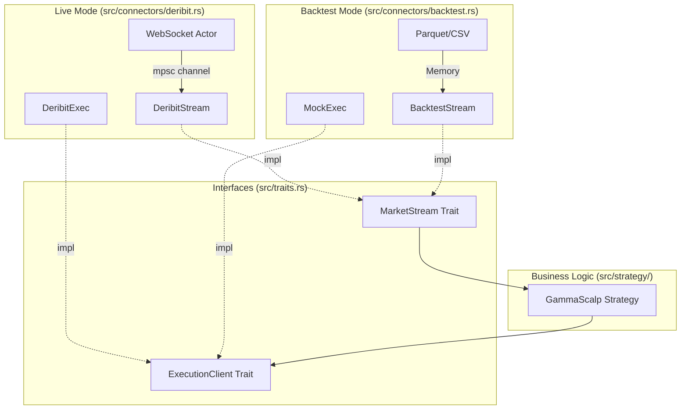

# Rust Async Trading Engine 🦀 📈

A high-performance, event-driven trading framework built in Rust. This engine is designed to seamlessly switch between **Live Trading** (via WebSockets) and **Backtesting** (via historical data) using zero-cost abstractions.

It solves the "Borrow Checker" challenges common in Rust trading systems by strictly segregating the **Read Path** (Market Data) from the **Write Path** (Execution).

## Building & Running

* Build: `cargo build`
* Backtest:`cargo run -- --mode backtest`

## 🚀 Features

* **Unified Interface:** Strategies are agnostic to the environment. The same code runs in production and in backtests.
* **Async-First:** Built on `Tokio` and `async-trait` for non-blocking I/O.
* **Deribit Integration:** Native support for Deribit's JSON-RPC WebSocket API (Subscription management, heartbeats, and auto-reconnection).
* **Zero-Overhead Abstraction:** Uses Rust generics and traits to compile optimized binaries for specific modes without runtime v-table overhead.
* **Type Safety:** Strong typing for Greeks (`delta`, `gamma`) and Order types prevents floating-point mishaps and logic errors.

## 🏗 Architecture

The system uses a **Trait-Based Engine** pattern.

