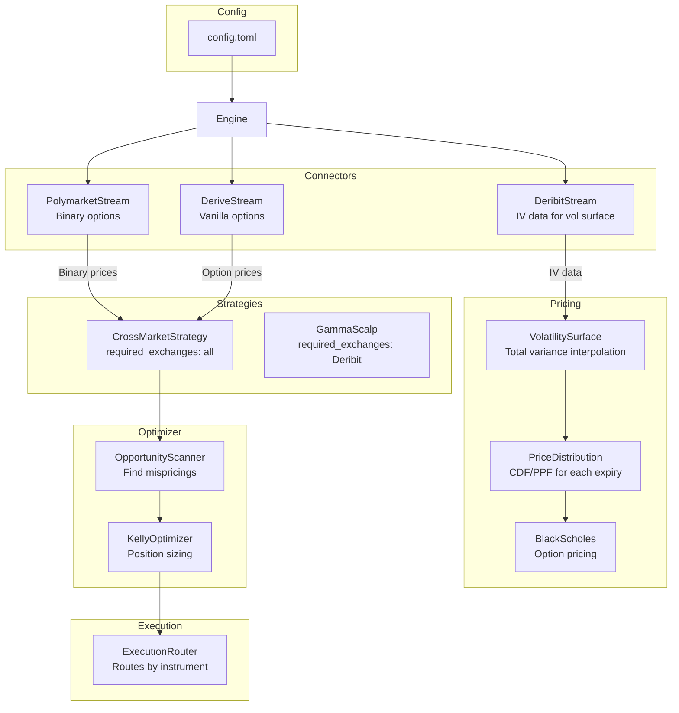

# Rust Async Trading Engine 🦀 📈

A high-performance, event-driven trading framework built in Rust. This engine is designed to run **multiple strategies concurrently** across **multiple exchanges**, with a **strategy-centric architecture** where strategies declare which exchanges they need and the engine auto-connects.

It solves the "Borrow Checker" challenges common in Rust trading systems by strictly segregating the **Read Path** (Market Data) from the **Write Path** (Execution).

## 🎯 What's New: Cross-Market Arbitrage Strategy

The engine now includes a sophisticated **CrossMarketStrategy** that identifies mispricings across BTC-related markets:

- **Volatility Surface Calibration**: Uses Deribit options as the source of truth for IV
- **Total Variance Interpolation**: Calendar arbitrage-free pricing across expiries
- **Polymarket Binary Options**: Identifies mispricings in "BTC above $X" markets
- **Kelly Optimization**: Position sizing based on expected utility maximization
- **Real-time Opportunity Scanning**: Finds edges of 10-300%+ on binary options

```
SCAN SUMMARY: PM=55 Derive=512 | opportunities=36
  OPPORTUNITY: polymarket | edge=39.0% | fair=0.348 vs market=0.250 | BTC above $86k Jan 4 - NO
  OPPORTUNITY: polymarket | edge=295.2% | fair=0.091 vs market=0.023 | BTC above $82k Jan 3 - NO
  OPPORTUNITY: polymarket | edge=53.0% | fair=0.078 vs market=0.051 | BTC above $94k Jan 2 - YES
```

## Building & Running

```bash
# Build
cargo build

# Generate a default config file
cargo run -- --generate-config > config.toml

# Live trading with config file
cargo run -- --config config.toml --dashboard 8080

# Demo mode with mock data
cargo run -- --mode demo --dashboard 8080

# Backtest from JSONL file
cargo run -- --mode backtest --file recordings/deribit_20251229.jsonl

# Backtest with realtime simulation (2x speed)
cargo run -- --mode backtest --file data.jsonl --realtime --speed 2.0
```

### Environment Variables

| Variable | Exchange | Required |
|----------|----------|----------|
| `DERIBIT_KEY` | Deribit | Only for live trading |
| `DERIVE_KEY` | Derive | Only for live trading |
| `POLYMARKET_KEY` | Polymarket | Only for live trading |

**Note**: API keys are NOT required for market data streaming. The strategy will receive real-time prices from all exchanges without keys.

## 📋 Configuration File

Strategies are defined in TOML format:

```toml
# config.toml

[global]
dashboard_port = 8080
subscription_refresh_secs = 60

# Cross-Market Arbitrage Strategy (NEW!)
[[strategies]]
type = "cross_market"
name = "CrossMarket-BTC"
currency = "BTC"
min_edge = 0.02                           # 2% minimum edge
max_time_to_expiry = 0.5                  # 6 months max
max_expiry_days = 90                      # Discovery horizon
initial_wealth = 10000.0                  # For Kelly sizing
risk_aversion = 1.0                       # γ=1 for log utility
n_scenarios = 10000                       # Monte Carlo scenarios
polymarket_pattern = "bitcoin-above-\\d+" # Regex for market discovery

# Other strategies
[[strategies]]
type = "gamma_scalp"
name = "GammaScalp-BTC"
exchanges = ["deribit"]
instruments = ["BTC-29MAR24-60000-C", "BTC-29MAR24-70000-C"]
threshold = 0.5

[[strategies]]
type = "momentum"
name = "Momentum-ETH"
exchanges = ["deribit"]
instruments = ["ETH-29MAR24-4000-C"]
lookback_period = 10
momentum_threshold = 0.02
```

## 🧠 CrossMarket Strategy Deep Dive

### How It Works

1. **Volatility Surface Construction**
   - Subscribes to Deribit BTC options across multiple expiries
   - Extracts mark_iv, bid_iv, ask_iv from ticker data
   - Builds a 2D surface indexed by (expiry, strike)
   - Uses total variance interpolation: `Var = σ² × T` for calendar-arbitrage-free pricing

2. **Price Distribution (PPF/CDF)**
   - For each expiry, precomputes P(S > K) using Black-Scholes
   - Interpolates for non-Deribit expiries (e.g., Polymarket Jan 3)
   - Creates inverse CDF for Monte Carlo scenario generation

3. **Opportunity Identification**
   - **Binary Options (Polymarket)**: Compares model probability vs market price
   - **Vanilla Options (Derive)**: Compares model fair value vs market price
   - Edge formula: `edge = (fair_value - market_price) / market_price`

4. **Kelly Optimization**
   - Maximizes expected utility of terminal wealth
   - Supports log utility (Kelly) and CRRA (adjustable risk aversion)
   - Uses Halton sequences for quasi-random Monte Carlo

### Output Interpretation

```
VOL SURFACE: spot=$88,311, 5 expiries, 152 iv_points
  Expiry 2025-12-31: ATM IV = 0.3083 (30.8%)
  Expiry 2026-01-16: ATM IV = 0.3833 (38.3%)

DISTRIBUTION (expiry 2025-12-31): grid $84,574 - $91,934
  P(S > $88,311) = 0.496  ← ATM probability ~50% ✓

SCAN SUMMARY: PM=55 Derive=512 | opportunities=9
  OPPORTUNITY: polymarket | edge=39.0% | fair=0.348 vs market=0.250 | BTC above $86k - NO
```

- **VOL SURFACE**: Shows spot price, number of expiries, and IV data points
- **ATM IV**: Should be 30-80% for BTC options
- **P(S > spot)**: Should be ~0.50 for ATM (sanity check)
- **Opportunities**: Each shows exchange, edge %, fair value, market price, and description

## 🧪 Testing

```bash
# Run all tests
cargo test

# Run cross-market strategy tests
cargo test cross_market:: --lib

# Run pricing tests
cargo test pricing:: --lib

# Run connector tests only
cargo test --lib connectors::

# Run with output
cargo test -- --nocapture
```

Unit tests cover:
- **CrossMarket**: Strike parsing, expiry parsing, token ID extraction, dashboard state
- **Pricing**: Black-Scholes, vol surface interpolation, CDF/PPF accuracy
- **Polymarket**: Order book logic, JSON deserialization, snapshot/delta flows
- **Deribit**: IV normalization, ticker parsing, Greeks handling
- **Catalogs**: Diff computation, time-travel reconstruction

## 🚀 Features

* **Cross-Market Arbitrage:** Identify mispricings between Deribit, Derive, and Polymarket.
* **Volatility Surface:** Build IV surfaces from Deribit with total variance interpolation.
* **Binary Option Pricing:** Price Polymarket YES/NO tokens using calibrated distribution.
* **Kelly Sizing:** Optimal position sizing based on edge and risk parameters.
* **Strategy-Centric:** Strategies declare exchanges they need; engine auto-connects.
* **Multi-Exchange:** Run strategies across Deribit, Derive, and Polymarket simultaneously.
* **Typed Instruments:** `Instrument::Deribit("BTC-29MAR24-60000-C")` prevents exchange mix-ups.
* **Execution Router:** Place orders on any exchange via `ExecutionRouter::place_order()`.
* **Historical Catalogs:** Time-travel support with `as_of(timestamp)` for backtests.
* **TOML Config:** Define strategies in config files, not code.
* **Dynamic Subscriptions:** `discover_subscriptions()` called periodically to update subscriptions.
* **Web Dashboard:** Real-time web UI with one tab per strategy.

## 🏗 Architecture

The system uses a unified **Engine** to manage multiple strategies across multiple exchanges:



**Flow:**
1. Config file defines CrossMarketStrategy with exchanges and parameters
2. Strategy discovers Polymarket markets matching regex pattern
3. Deribit IVs flow in and build the volatility surface
4. Polymarket/Derive prices flow in and get compared to model fair values
5. OpportunityScanner identifies mispricings with positive edge
6. KellyOptimizer determines position sizes
7. ExecutionRouter places orders on the appropriate exchange

## 📦 Core Types

### Pricing Module

```rust
// Volatility smile for a single expiry
pub struct VolSmile {
    time_to_expiry: f64,
    underlying_price: f64,
    points: BTreeMap<u64, IVPoint>,  // strike -> IV
}

// Full volatility surface across expiries
pub struct VolatilitySurface {
    smiles: BTreeMap<i64, VolSmile>,  // expiry_timestamp -> smile
    spot_price: f64,
}

// Get interpolated IV using total variance
let iv = surface.get_iv_interpolated(strike, time_to_expiry, now_ms);

// Price distribution for Monte Carlo
pub struct PriceDistribution {
    distributions: BTreeMap<i64, ExpiryDistribution>,
}

// Get probability that S > K at expiry (with interpolation)
let prob = distribution.probability_above(strike, expiry_timestamp);
```

### Opportunity

```rust
pub struct Opportunity {
    pub id: String,
    pub opportunity_type: OpportunityType,  // BinaryYes, BinaryNo, VanillaCall, etc.
    pub exchange: String,
    pub instrument_id: String,
    pub description: String,
    pub strike: f64,
    pub expiry_timestamp: i64,
    pub direction: TradeDirection,
    pub market_price: f64,
    pub fair_value: f64,
    pub edge: f64,                          // (fair - market) / market
    pub max_profit: f64,
    pub max_loss: f64,
    pub liquidity: f64,
    pub model_probability: Option<f64>,     // For binary options
}
```

### Strategy Trait

```rust
#[async_trait]
pub trait Strategy: Dashboard + Send + Sync {
    fn name(&self) -> &str;
    
    /// Static: which exchanges this strategy needs
    fn required_exchanges(&self) -> HashSet<Exchange>;
    
    /// Dynamic: discover instruments via catalog queries
    async fn discover_subscriptions(&self) -> Vec<Instrument>;
    
    /// Called when a market event arrives
    async fn on_event(&self, event: MarketEvent);
}
```

## 🕰 Historical Catalogs

Catalogs support **time-travel** for backtesting:

```rust
use crate::catalog::{Catalog, PolymarketCatalog};

let catalog = PolymarketCatalog::new(None).await;

// Current state
let current = catalog.current();

// State as of a specific timestamp
let historical = catalog.as_of(1704067200); // Jan 1, 2024

// Find markets by regex
let btc_markets = catalog.find_by_slug_regex(r"bitcoin-above-\d+")?;

// Refresh and track changes
let diff = catalog.refresh().await?;
```

## 📁 Project Structure

```
src/
├── main.rs              # CLI, mode selection
├── lib.rs               # Module exports
├── config.rs            # TOML config parsing, strategy registry
├── models.rs            # Instrument, Exchange, MarketEvent, Order
├── traits.rs            # Strategy, MarketStream, ExecutionClient, ExecutionRouter
├── engine/
│   └── mod.rs           # Unified Engine, MarketRouter
├── catalog/
│   ├── mod.rs           # Catalog trait, CatalogDiff, time-travel helpers
│   ├── deribit.rs       # DeribitCatalog
│   ├── derive.rs        # DeriveCatalog
│   └── polymarket.rs    # PolymarketCatalog (with regex search)
├── dashboard/
│   └── mod.rs           # DashboardServer, REST API, WebSocket
├── pricing/
│   ├── mod.rs           # Module exports
│   ├── black_scholes.rs # BS pricing, norm_cdf, norm_ppf
│   ├── vol_surface.rs   # VolSmile, VolatilitySurface, total variance interpolation
│   └── distribution.rs  # ExpiryDistribution, PriceDistribution, PPF/CDF
├── optimizer/
│   ├── mod.rs           # Module exports
│   ├── opportunity.rs   # Opportunity, OpportunityScanner
│   ├── kelly.rs         # KellyOptimizer, CRRA utility
│   └── sobol.rs         # Halton sequence for quasi-random MC
├── strategy/
│   ├── mod.rs           # Strategy exports
│   ├── cross_market.rs  # CrossMarketStrategy (main strategy!)
│   ├── gamma_scalp.rs   # Delta-based hedging strategy
│   └── momentum.rs      # Price momentum strategy
└── connectors/
    ├── deribit.rs       # Deribit WebSocket + IV normalization
    ├── derive.rs        # Derive (Lyra) WebSocket + REST
    ├── polymarket.rs    # Polymarket CLOB WebSocket + order book
    └── backtest.rs      # BacktestStream, HistoricalStream, RecordingStream
```

## 📊 Web Dashboard

```bash
cargo run -- --config config.toml --dashboard 8080
# Open http://localhost:8080
```

The dashboard shows:
- **Spot Price**: Current BTC price from Deribit
- **Vol Surface Stats**: Number of expiries and IV data points
- **Opportunities Table**: All identified mispricings with edge %
- **Activity Log**: Recent strategy actions

### REST API

| Endpoint | Description |
|----------|-------------|
| `GET /` | Embedded frontend HTML |
| `GET /api/strategies` | List all strategies |
| `GET /api/strategies/:name` | Get strategy state |
| `GET /api/strategies/:name/schema` | Get dashboard schema |
| `GET /ws` | WebSocket for real-time updates |

## CLI Reference

```
trading-bot [OPTIONS]

Options:
  --mode <MODE>          Mode: live, backtest, demo [default: live]
  --config <FILE>        Path to TOML configuration file
  --strategies <LIST>    Comma-separated strategy names (quick testing)
  --file <FILE>          JSONL file for backtest mode
  --as-of <TIMESTAMP>    Historical catalog timestamp for backtest
  --realtime             Enable realtime playback simulation
  --speed <FLOAT>        Playback speed multiplier [default: 1.0]
  --dashboard <PORT>     Enable web dashboard on PORT
  --generate-config      Print default config template and exit
```

## TODOs

* P1: ~~Implement cross-market BTC trading strategy.~~ ✅ DONE
* P1: Add execution logic to actually place trades on identified opportunities.
* P2: Implement `refresh_subscriptions` in deribit.rs and derive.rs.
* P2: Allow dashboard to enable/disable strategies.
* P3: Implement real trading execution for the various exchanges.

## LLM Context Cheatsheet

```bash
cat README.md Cargo.toml src/**/*.rs > ignore.txt
```
