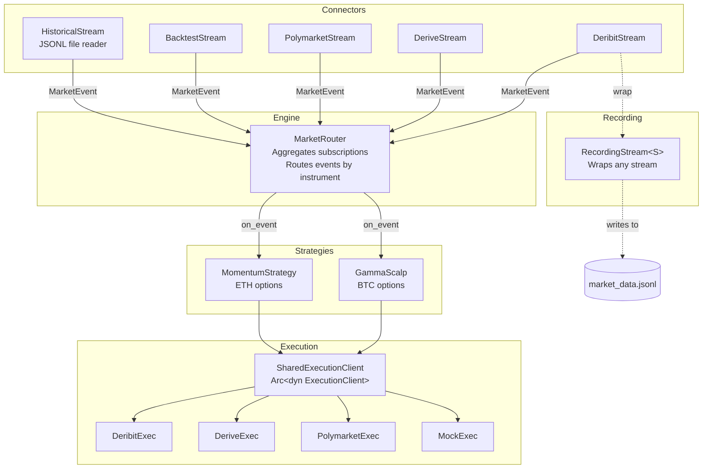

# Rust Async Trading Engine 🦀 📈

A high-performance, event-driven trading framework built in Rust. This engine is designed to run **multiple strategies concurrently** while sharing a single WebSocket connection per exchange, seamlessly switching between **Live Trading** and **Backtesting**.

It solves the "Borrow Checker" challenges common in Rust trading systems by strictly segregating the **Read Path** (Market Data) from the **Write Path** (Execution).

## Building & Running

```bash
# Build
cargo build

# Backtest (multiple strategies on mock data)
cargo run -- --mode backtest

# Historical backtest from JSONL file
cargo run -- --mode historical-backtest --file data/market_data.jsonl

# Historical backtest with realtime simulation (2x speed)
cargo run -- --mode historical-backtest --file data/market_data.jsonl --realtime --speed 2.0

# Live trading on Deribit
DERIBIT_KEY=your_api_key cargo run -- --mode live-deribit

# Live trading on Polymarket
cargo run -- --mode live-poly

# Live trading on Derive
cargo run -- --mode live-derive
```

## 🧪 Testing

```bash
# Run all tests
cargo test

# Run connector tests only
cargo test --lib connectors::

# Run with output
cargo test -- --nocapture
```

Unit tests cover:
- **Polymarket**: Order book logic (`LocalOrderBook`), JSON deserialization, snapshot/delta flows
- **Deribit**: IV normalization, ticker parsing, Greeks handling
- **Derive**: Instrument filtering

## 🚀 Features

* **Multi-Strategy Engine:** Run multiple strategies concurrently, each declaring which instruments it needs.
* **Subscription Aggregation:** One WebSocket connection per exchange with automatic subscription merging.
* **Unified Interface:** Strategies are agnostic to the environment—same code runs in production and backtests.
* **Async-First:** Built on `Tokio` and `async-trait` for non-blocking I/O.
* **Exchange Support:** Native integration for Deribit, Derive (options/futures), and Polymarket (prediction markets).
* **Historical Data:** Record live streams to JSONL files and replay them for backtesting with optional realtime simulation.
* **Market Discovery:** Search markets by slug, description, or regex patterns via `MarketCatalog` trait.
* **Shared Execution:** Thread-safe execution clients (`SharedExecutionClient`) allow strategies to share connections.
* **Type Safety:** Strong typing for Greeks (`delta`, `gamma`) and Order types prevents logic errors.

## 🏗 Architecture

The system uses a **MarketRouter** to fan out market events to multiple strategies:



**Flow:**
1. Each strategy declares `required_subscriptions()` (e.g., `["BTC-29MAR24-60000-C"]`)
2. `MarketRouter` aggregates all subscriptions and creates ONE stream per exchange
3. Incoming `MarketEvent`s are routed only to strategies that subscribed to that instrument
4. Strategies share a `SharedExecutionClient` (`Arc<dyn ExecutionClient>`) for thread-safe order placement

## 📼 Historical Data & Recording

The framework supports file-based backtesting using JSONL (JSON Lines) format, where each line is a serialized `MarketEvent`.

### Data Format

```json
{"timestamp":1700000000,"instrument":"BTC-29MAR24-60000-C","best_bid":100.0,"best_ask":101.0,"delta":0.6}
{"timestamp":1700000001,"instrument":"ETH-29MAR24-4000-C","best_bid":50.0,"best_ask":51.0,"delta":0.3}
{"timestamp":1700000002,"instrument":"BTC-29MAR24-60000-C","best_bid":102.0,"best_ask":103.0,"delta":0.7}
```

### Recording Live Data

Use `RecordingStream` to capture live market data for future backtests:

```rust
use trading_bot::connectors::backtest::RecordingStream;
use trading_bot::connectors::deribit::DeribitStream;

// Wrap any live stream to record its events
let live_stream = DeribitStream::new(instruments).await;
let recording_stream = RecordingStream::new(live_stream, "recorded_data.jsonl")?;

// Events flow through to your strategies AND get saved to disk
let router = MarketRouter::new(recording_stream, strategies);
router.run().await;
```

### Playback Options

| Flag | Description |
|------|-------------|
| `--file <path>` | Path to JSONL data file (required) |
| `--realtime` | Sleep between events based on timestamp deltas |
| `--speed <float>` | Playback speed multiplier (default: 1.0) |

Realtime playback is useful for testing strategies that depend on wall-clock time or rate limiting.

## 📁 Project Structure

```
src/
├── main.rs              # Entry point, mode selection
├── lib.rs               # Module exports
├── models.rs            # MarketEvent, Order, exchange-specific types
├── traits.rs            # Strategy, MarketStream, ExecutionClient traits
├── engine/
│   └── mod.rs           # MarketRouter (pub/sub event distribution)
├── catalog/
│   ├── mod.rs           # MarketCatalog trait + shared types
│   └── polymarket.rs    # Polymarket market discovery
├── strategy/
│   ├── gamma_scalp.rs   # Delta-based hedging strategy
│   └── momentum.rs      # Price momentum strategy
└── connectors/
    ├── deribit.rs       # Deribit WebSocket + REST
    ├── derive.rs        # Derive (Lyra) WebSocket + REST
    ├── polymarket.rs    # Polymarket CLOB WebSocket
    └── backtest.rs      # BacktestStream, HistoricalStream, RecordingStream, MockExec
```

## 🔌 Adding a New Strategy

1. Create a new file in `src/strategy/`:

```rust
use crate::models::MarketEvent;
use crate::traits::{Strategy, SharedExecutionClient};
use async_trait::async_trait;
use std::sync::Arc;

pub struct MyStrategy {
    name: String,
    instruments: Vec<String>,
    exec: SharedExecutionClient,
}

impl MyStrategy {
    pub fn new(name: impl Into<String>, instruments: Vec<String>, exec: SharedExecutionClient) -> Arc<Self> {
        Arc::new(Self { name: name.into(), instruments, exec })
    }
}

#[async_trait]
impl Strategy for MyStrategy {
    fn name(&self) -> &str { &self.name }
    
    fn required_subscriptions(&self) -> Vec<String> { 
        self.instruments.clone() 
    }
    
    async fn on_event(&self, event: MarketEvent) {
        // Your logic here
    }
}
```

2. Export it in `src/strategy/mod.rs`
3. Add it to the strategies list in `main.rs`

## 🔌 Adding a New Exchange

Implement the `MarketStream` and `ExecutionClient` traits:

```rust
#[async_trait]
impl MarketStream for MyExchangeStream {
    async fn next(&mut self) -> Option<MarketEvent> { /* ... */ }
}

#[async_trait]
impl ExecutionClient for MyExchangeExec {
    async fn place_order(&self, order: Order) -> Result<OrderId, String> { /* ... */ }
}
```

The `MarketRouter` works with any `MarketStream` implementation.

## 🔍 Market Discovery with Catalogs

The `MarketCatalog` trait enables strategies to discover markets dynamically. This is useful for strategies that need to find new markets as they're created (e.g., daily BTC price prediction markets on Polymarket).

### Usage Example

```rust
use crate::catalog::{MarketCatalog, PolymarketCatalog, TokenInfo};

// Create catalog (loads from cache, auto-refreshes if stale)
let catalog = PolymarketCatalog::new(None).await;

// Search by text (weighted: slug 8x, question 4x, tags 2x, description 1x)
let results = catalog.search("bitcoin price december", 10);
for r in results {
    println!("{}: {}", r.market.slug.unwrap_or_default(), r.score);
}

// Find by exact slug
if let Some(market) = catalog.find_by_slug("will-bitcoin-be-above-100000") {
    // Get tokens by outcome name (not array index!)
    if let Some(yes) = market.yes_token() {
        println!("YES token: {}", yes.token_id);
    }
    if let Some(no) = market.no_token() {
        println!("NO token: {}", no.token_id);
    }
}

// Find by regex pattern (useful for recurring market patterns)
let btc_markets = catalog.find_by_slug_regex(r"^will-bitcoin-be-above-\d+")?;

// For multi-outcome markets (e.g., elections), use token_by_outcome
if let Some(market) = catalog.find_by_slug("who-will-win-2024-election") {
    if let Some(trump) = market.token_by_outcome("Trump") {
        println!("Trump token: {}", trump.token_id);
    }
}

// Manual refresh (runs in background by default if cache is >1 day old)
let count = catalog.refresh().await?;
```

### Available Methods

| Method | Description |
|--------|-------------|
| `search(query, limit)` | Weighted text search across slug, question, tags, description |
| `find_by_slug(slug)` | Exact slug match |
| `find_by_slug_regex(pattern)` | Regex match on slugs |
| `find_by_token_id(token_id)` | Find market containing a token ID |
| `get(id)` | Get market by condition_id |
| `all()` | Get all cached markets |
| `refresh()` | Fetch fresh data from exchange API |
| `last_updated()` | Unix timestamp of last refresh |

The catalog caches to `polymarket_markets.jsonl` and auto-refreshes in the background when the cache is older than 1 day.

### Key Types

- **`TokenInfo`** — A token with its `token_id` and `outcome` (e.g., "Yes", "No", "Trump")
- **`MarketInfo`** — Market metadata with `tokens: Vec<TokenInfo>` preserving outcome associations
- **`MarketCatalog`** — Trait for market discovery (search, regex, lookup)

The catalog caches to `polymarket_markets.jsonl` and auto-refreshes when the cache is older than 1 day.
